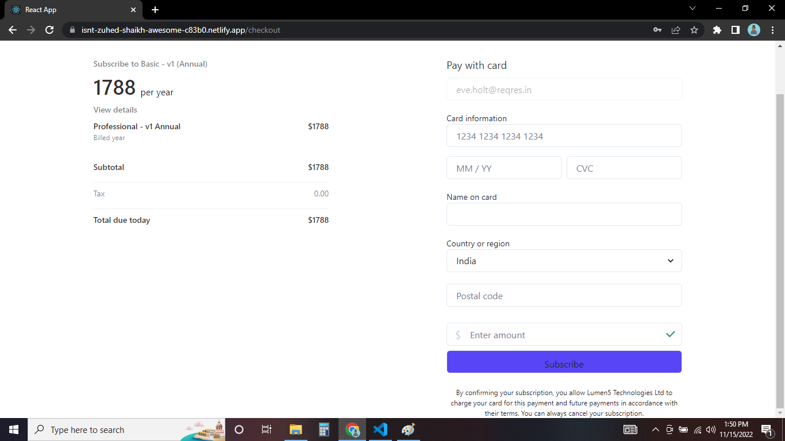

# Lumen5 Clone
    An individual project to develop this app within the span of 5 days.
    Lumen5 is a video creation platform powered by A.I. that enables anyone without training or experience to easily create engaging video content.

## Tech Stack
- ReactJs
- JavaScript
- CSS3

## Libraries
- React router dom
- Chakra UI
- Netlify CLI
    

## Features
- ### Dashboard
    - 
    
     
     
     

- ### Videos Section
    - 

     
     
     

- ### Pricing
    - 

     
     
     

- ### Payments
    - 

     
     
     